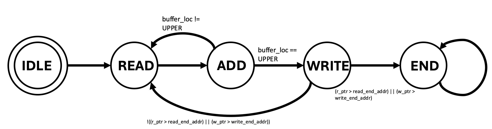

# SVCalculator – SystemVerilog Calculator Verification Project

This repository contains a **SystemVerilog verification environment** for a simple calculator design.
You will complete the testbench, run simulations, and use waveforms and coverage to verify that the
DUT (Device Under Test) behaves correctly.

---

## Project at a Glance

The testbench wraps around a calculator RTL module and drives **add** operations plus memory reads/writes.
The picture below shows how the testbench pieces connect to the DUT:


- **Driver** – converts high‑level transactions into pin‑level stimulus on the DUT.
- **Monitor** – watches DUT I/O and reconstructs transactions.
- **Scoreboard** – compares DUT outputs against a golden reference model.
- **Sequence item** – bundles all fields for a single calculator transaction.

---

## Calculator Behavior and FSM

Internally, the calculator is controlled by a finite state machine (FSM) that sequences through
**loading operands**, **performing addition**, and **writing/reading memory**.



You will use this state diagram to understand:
- **Which signals change in each state** (e.g., load, add, write, read).
- **When results are valid** and when memory transactions occur.
- How reset should bring the FSM back to a known idle state.

When you write assertions and coverage, you will target these states and transitions.

---

## Repository Layout

- `src/verilog/`
  - `adder32.sv`, `result_buffer.sv`, `controller.sv`, `top_lvl.sv` – calculator RTL and top‑level wrapper.
  - `calc_driver.svh` – driver class that sends calculator transactions to the DUT. **You complete this.**
  - `calc_monitor.svh` – monitor class that samples DUT signals and builds transactions. **You complete this.**
  - `calc_sb.svh` – scoreboard that checks DUT outputs vs. a reference model. **You complete this.**
  - `calc_seq_item.svh` – sequence item class with all fields for a transaction. **You complete this.**
  - `calc_tb_top.sv` – top‑level testbench tying everything together. **You complete this.**
- `sim/behav/`
  - `Include/calculator.include` – list of RTL + TB files to compile.
  - `Makefile` – main entry point for running simulations and coverage.
- `screenshots/`
  - `tb_connection.png` – testbench block diagram.
  - `fsm.png` – calculator controller FSM.
  - `coverage.png` – example coverage report in Verdi.

---

## How the Verification Flow Works

1. **Write a test plan**  
   Describe both directed and randomized tests for:
   - Basic addition (with/without overflow).
   - SRAM read/write and edge cases on addresses/data.
   - Reset behavior and illegal scenarios.

2. **Implement testbench components**  
   Fill in:
   - `calc_driver.svh`, `calc_monitor.svh`, `calc_sb.svh`, `calc_seq_item.svh`, and `calc_tb_top.sv`.
   - Use the FSM diagram to know when to sample/check values.

3. **Run simulations and debug with waveforms**  
   - Use Xcelium (`xrun`) to run the testbench.
   - Use Verisium Debug to visualize the signals and correlate them with your test cases.

4. **Add assertions and constrained random tests**  
   - Add **concurrent assertions** to:
     - Check reset behavior.
     - Ensure LSBs are processed before MSBs in addition.
     - Ensure addresses are always in a legal range.
   - Add **constraints** in `calc_seq_item.svh` for randomized transactions.

5. **Measure and close coverage**  
   - Use Verdi coverage tools to measure how thoroughly your tests exercised the DUT.

An example coverage report (what you are aiming for) looks like this:


Your goal is to reach at least **96% coverage** on the DUT (`my_calc`).

---

## Running the Project

All commands below assume you are in the `sim/behav` directory:

```bash
cd sim/behav
```

### Compile and run with Xcelium

```bash
make xrun
```

- If there are errors:
  - Fix syntax/connection issues in the RTL or testbench.
  - Re‑run `make xrun` until the simulation completes.

### View waveforms with Verisium Debug

```bash
make verisium
```

Then:
- Use the hierarchy tree to add modules/signals to the waveform.
- Run the simulation from within Verisium Debug.
- Use the FSM and block diagrams to understand unexpected behavior.

### Run coverage with VCS + Verdi

From `sim/behav`:

1. Link design:

   ```bash
   make link
   ```

2. In the `Makefile`, set `VERILOG_DEFINES` so that `VCS=1` (instead of `CADENCE=1`).

3. Build and run with VCS:

   ```bash
   make vcs
   make coverage
   ```

4. Open the coverage report in Verdi and load `exclusions.el` to ignore unreachable coverage points.

Afterward, you can switch `VERILOG_DEFINES` back to `CADENCE=1` to keep using Xcelium/Verisium for day‑to‑day simulation.

---

## What You Turn In

- **Completed testbench files**  
  `calc_sb.svh`, `calc_driver.svh`, `calc_monitor.svh`, `calc_seq_item.svh`, `calc_tb_top.sv`

- **Simulation log**  
  `simulation.log` showing all test cases **PASSED**.

- **Coverage screenshot**  
  Screenshot from Verdi showing **≥ 96%** coverage on the DUT.

- **Completed test plan**  
  Filled‑out test plan document describing all your test cases and assertions.

---

## Helpful References

- **SystemVerilog classes**
  - [ChipVerify – SystemVerilog Class](https://www.chipverify.com/systemverilog/systemverilog-class)
  - [Doulos – SystemVerilog Classes Tutorial](https://www.doulos.com/knowhow/systemverilog/systemverilog-tutorials/systemverilog-classes-tutorial/)

- **Constrained Random Verification (CRV)**
  - [SystemVerilog Randomization](https://www.chipverify.com/systemverilog/systemverilog-randomization)
  - [SystemVerilog Constraints](https://www.chipverify.com/systemverilog/systemverilog-constraints)
  - [Constraint Random Verification](https://www.chipverify.com/verification/constraint-random-verification)

- **SystemVerilog Assertions (SVA)**
  - [Doulos – Assertions Tutorial](https://www.doulos.com/knowhow/systemverilog/systemverilog-tutorials/systemverilog-assertions-tutorial/)
  - [systemverilog.io – SVA Basics](https://www.systemverilog.io/verification/sva-basics/)

- **Clocking blocks**
  - [Doulos – Clocking Tutorial](https://www.doulos.com/knowhow/systemverilog/systemverilog-tutorials/systemverilog-clocking-tutorial/)
  - ChipVerify: [Clocking Blocks Part 1](https://www.chipverify.com/systemverilog/systemverilog-clocking-blocks) and [Part 2](https://www.chipverify.com/systemverilog/systemverilog-clocking-blocks-part2)

- **Code coverage**
  - [ChipVerify – Code Coverage](https://www.chipverify.com/verification/code-coverage)
