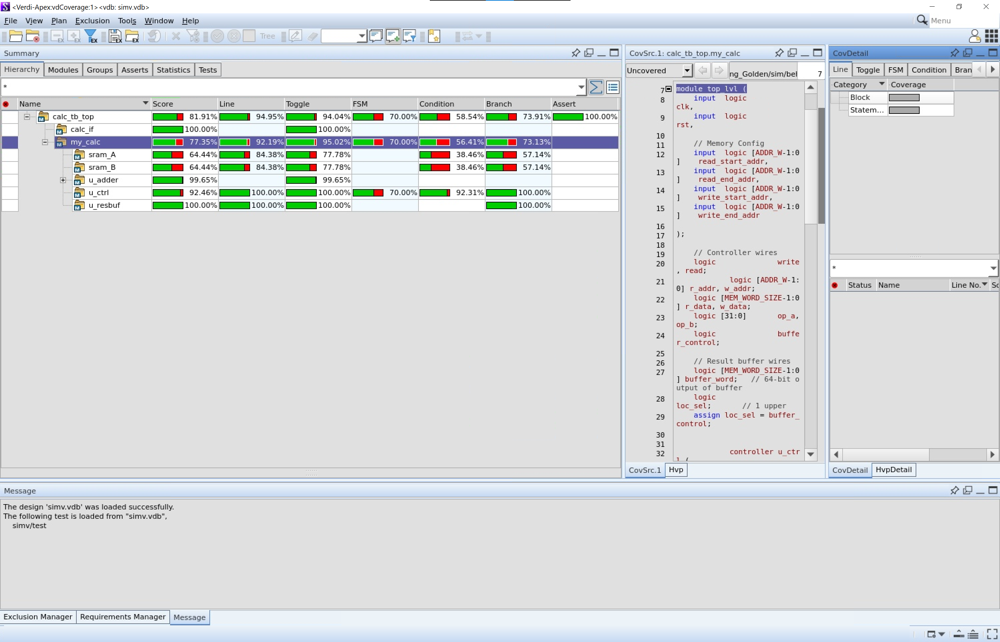

# Verification Onboarding Project

## Subteam Overview
### Description:
The  verification subteam is responsible for verifying the functionality of the chip in the pre-silicon stage. The subteam will work with the design team to formulate test plans required to verify chip functional correctness using standard practices.
### Responsibilities:
This subteam  is responsible for the logic and software verification of the design and as such individual team members are expected to contribute towards that end. This team will receive designs from the RTL team and detects bugs in RTL through simulation. In simulation, the team will design testbenches and create tests cases to ensure that the logic works as expected.

Related to these primary goals, the verification team will also develop software for thorough testing and scripts for automated testing. When bugs are found, the verification team will report to the RTL team who will revise and resubmit their design.
### Tools Used
* Verification Software
* Compilers (Xcelium, etc.)
* Waveform Viewers (SimVision, Verisium Debug, etc.)
* Coverage Analysis (Verdi)

## Onboarding Project
### Premise
The idea of this onboarding project is both to get you set up with the suite of tools we use on this team, and to provide you with an introduction to the structure of a typical testbench you may create and how it interacts with a Device Under Test (DUT). You will be debugging and then running this testbench to identify problems.

### Testbench Overview and Important Files

1. `src/verilog/calc_driver.svh` Defines the driver component, which translates high-level test transactions into low-level signal toggles to control the calculator DUT. **You need to fill out this file**
2. `src/verilog/calc_monitor.svh` Defines the monitor component, which monitors all transactions driven by the driver to the DUT. It passes along these transactions to the scoreboard to check for functional correctness. **You need to fill out this file**
3. `src/verilog/calc_sb.svh` Defines the scoreboard component, which verifies the correctness of the DUT by comparing its output against a golden reference model. **You need to fill out this file**
4. `src/verilog/calc_seq_item.svh` Defines the sequence item object, which contains all of the signals needed in a transaction. Transactions are performed between testbench components and the DUT, so the sequence item class contains all the data needed by every component in the transaction. **You need to fill out this file**
5. `src/verilog/calc_tb_top.sv` This is the top-level testbench for the calculator module. **You need to fill out this file**
6. `sim/behav/Include/calculator.include` A text file listing the source files needed for the simulation.
7. `sim/Makefile` The Makefile used for launching simulation. Type `make` or `make help` while in the `sim` directory to get a list of options

## Steps
### 1. Writing your Test Plan
Here is one methodology for writing a test plan to comprehensively test an RTL design. It is not the only way to create a test plan, but this should provide a helpful guide if you don't know how to approach making a test plan.
1. First, think about the main objective that the RTL should achieve in normal operation. For the calculator module, the main objective is to correctly calculate the results.
   * **Functional Testing**: Ensure basic addition (both with and without overflow) and the core memory read/write functions are correct.

2. Next, think about edge cases of the RTL. Since this is a math function, you should think about the domain and range of the function and how much of that will be supported in hardware. Consider the boundary conditions and special input values that might reveal unexpected hardware behavior. Hardware implementations may not behave as you expect, especially at the limits of their data types.
   * **Boundary Testing**: For example, test adding `0 + 0`, `MAX + MAX`, and `0 + MAX` to ensure the design behaves correctly under extreme conditions.

3. To ensure that data moves correctly between the controller and the SRAM. You need to verify the correct flow of data between the controller and the SRAM. It focuses on ensuring that read and write operations are executed and verified successfully.
   * **Data Read:** Verify that the controller correctly reads data from the SRAM.
   * **Data Write:** Verify that data written by the controller is correctly stored in the SRAM.

4. The way the hardware operates is also important to consider. Most RTL modules have clock and reset inputs (clock may not be present if the module is purely combinational). It’s important to always check if resetting the design works. During normal operation, a signal may fail to get captured by a FF due to propagation delays and the RTL can enter an unknown state. Resetting the design allows it to enter a known working state which will allow the chip to continue working as intended. It is also important to check what the design specification says initial values should be for outputs upon reset.
   * **Timing and Reset Tests**: Use assertion-based tests to verify that the reset signal correctly brings the design back to an idle state. 

5. Assertions are a powerful way to verify that a design's internal behavior and timing sequences are correct, even when the outputs aren't changing. They help catch bugs that might not be visible at the top-level ports. 
   * **Verify that LSBs are added before MSBs**: This test uses an assertion to monitor the internal data path, ensuring that the adder processes the least significant bits before the most significant bits. This guarantees the correct behavior as given in the design specification, so that the state machine can be confirmed that it's correct.
   * **Verify the valid input addr range**: This test case uses an assertion to ensure that all input addresses fall within the valid range specified by the design. This helps confirm that only valid test cases are provided to the DUT.
   * **Optional**: Think of more tests to verify the design's internal behavior and timing with assertions.

6. Each test case in your plan should include specific input values if necessary and the expected output value for those given inputs. It should be clear for anyone to read your test plan and be able to implement the tests in a testbench.

A template of a test plan has been provided for you to fill out. Please use this template to submit your completed test plan. Here are some instructions on filling out the test plan:
1. Group your test cases by similar functionality to make the test plan more organized
2. In the header of the right column of each table, describe what the group of test cases is testing
3. In the left column, briefly describe the test case and what edge case it’s testing for
4. The right column should contain the exact inputs and expected output as well as any steps required to make the RTL enter a certain state
5. For the assertions, make sure to include the full assertion syntax that you would put in your testbench!

### 2. Environment setup
1. Make sure you have signed the [Cadence EULA](https://eulas.ece.gatech.edu/cadence/) for Cadence software AND [Synopsys EULA](https://eulas.ece.gatech.edu/synopsys/) for Synopsys software, selecting that you are using it for research under advisor Visvesh Sathe and project as SiliconJackets
2. ssh onto `ece-rschsrv.ece.gatech.edu` using a method that provides an Xserver for viewing graphical programs such as MobaXterm or FastX
3. type `tcsh` into the terminal to switch to tcl shell
4. run `source /tools/software/cadence/setup.csh` to load commands for Cadence tools and run `source /tools/software/synopsys/setup.csh` for Synopsys tools. Optionally add both commands to your `.my-cshrc` file in your home directory
5. To set up the Verisium Debug waveform viewer, add these two commands to your `.my-cshrc` file in your home directory: `setenv VERISIUM_DEBUG_ROOT "/tools/software/cadence/verisumdbg/latest"` and `setenv PATH "${PATH}:${VERISIUM_DEBUG_ROOT}/bin:${VERISIUM_DEBUG_ROOT}/tools/bin"`
6. clone this repo if you haven't already: `git clone https://github.gatech.edu/SiliconJackets/New_DV_Onboarding.git`

### 3. Make sure files compile
1. Start by editing the files adder32.sv/result_buffer.sv/controller.sv/top_lvl.sv in the src/verilog directory with the changes you made during the digital design onboarding.
3. cd to sim/behav directory
4. run `make xrun`

You may have some errors in the output. Figure out what is wrong with the tb file and fix any syntax errors. Rerun each time with `make xrun`.

### 4. Run testbench for the first time
The first time you run the tb without errors using `make xrun`, the testbench will say "TEST PASSED" even though no tests have been implemented yet.

For waveform and simulation debugging, it is highly recommended to use Verisium Debug. Verisium Debug is an advanced debugging and verification platform from Cadence widely used in hardware design to analyze waveforms, debug RTL code, and validate assertions. It provides a GUI for visualizing signal activity, exploring design hierarchies, and tracking simulation data to pinpoint issues effectively. It also can display the values of the SRAM memory arrays!

To run Verisium Debug, run `make verisium` in MobaXterm (slow) or FastX (recommended). To add signals to the waveform debugger, go to the "Hierarchy" tab below and right-click on a module or a signal after selecting a module to use the "Send to Wave". You need to run the simulation with the play button at the top to generate the values in the waveform viewer. If you add a signal after running the simulation, you'll need to reset the simulation with the back button to the left of the play button, and re-run the simulation. You should cross-reference the waveform with the generated `simulation.log` to effectively debug your design as well as implement the testbench items.

### 5. Rerun testbench after filling out the driver, monitor, and scoreboard
Make sure you can pass all of your tests.

### 6. Add Assertions to Verify Signal Behavior
Assertions are essential for automatically validating signal behavior and ensuring that design constraints and requirements are met during simulation. They help identify edge cases, unexpected behaviors, and violations by monitoring signals and conditions concurrently without requiring manual intervention. By providing immediate feedback when failures occur, assertions improve debugging efficiency and enhance the reliability of the design verification process.

Add **concurrent assertions** to check that:
   - Reset functionality works correctly.
   - Values are added to LSBs before MSBs.
   - Input address ranges are valid.

### 7. Add Randomized Constrained Testing
Randomized constrained testing in SystemVerilog is similar to Python-based randomized testing in that both aim to identify unexpected edge cases by generating diverse input combinations; however, SystemVerilog's approach is inherently tailored for hardware verification with built-in constraints and functional coverage. Unlike Python, where you manually manage input generation and test coverage tracking, SystemVerilog allows you to define input constraints within a rand class, ensuring generated test vectors are valid while covering the input space comprehensively. These constraints need to be written in the `calc_seq_item.svh` file.

### 8. Use Verdi to Report Coverage Analysis
To view your coverage report in Verdi, run `make link`, change `VERILOG_DEFINES` in the Makefile to `VCS=1` instead of `CADENCE=1`, run `make vcs`, then `make coverage`. Set it back to `CADENCE=1` to use Xcelium and the Cadence waveform viewers later. Make sure you are in the `sim/behav` directory:

You will need to use an exclusion file because there are some coverage targets that are impossible to hit in the DUT. `exclusions.el` is the exclusion file you will use which is located in `sim/behav`. In Verdi, go to Exclusion > Load Exclusions from File and open the `exclusions.el` file to increase your coverage.

In industry, typically DV teams reach a minimum 98% coverage score (or even 100% sometimes!) before confirming a DUT is verified. For the sake of our onboarding, we will try to reach at least **96%** coverage. Once all of the tests are implemented, you should be able to achieve this score. To clarify, you only need to reach 96% coverage for the **DUT** only which is my_calc in the screenshot above, you do not need to worry about the coverage of the actual testbench itself.

### 9. Complete Testplan
If you have any remaining tests that you didn't implement in your testplan, and you still haven't reached 96% coverage of your DUT, implement additional tasks or assertions based on your testplan to cover edgecases.

## Deliverables
1. Screenshot of Verdi with at least 96% overall coverage score

2. Completed Testplan document

3. Submit file `calc_sb.svh`, `calc_driver.svh`, `calc_monitor.svh`, `calc_seq_item.svh`, `calc_tb_top.sv`

4. Submit `simulation.log` with all testcases PASSED

## Resources

SystemVerilog Class
- [ChipVerify](https://www.chipverify.com/systemverilog/systemverilog-class)
- [Doulos](https://www.doulos.com/knowhow/systemverilog/systemverilog-tutorials/systemverilog-classes-tutorial/)

Constrained Random Verification (CRV)
- [SystemVerilog Randomization](https://www.chipverify.com/systemverilog/systemverilog-randomization)
- [SystemVerilog Constraints](https://www.chipverify.com/systemverilog/systemverilog-constraints)
- [CRV](https://www.chipverify.com/verification/constraint-random-verification)

SystemVerilog Assertions (SVA)
- [Doulos](https://www.doulos.com/knowhow/systemverilog/systemverilog-tutorials/systemverilog-assertions-tutorial/)
- [systemverilog.io](https://www.systemverilog.io/verification/sva-basics/)

Clocking Block
- [Doulos](https://www.doulos.com/knowhow/systemverilog/systemverilog-tutorials/systemverilog-clocking-tutorial/)
- ChipVerify: [Part 1](https://www.chipverify.com/systemverilog/systemverilog-clocking-blocks) and [Part 2](https://www.chipverify.com/systemverilog/systemverilog-clocking-blocks-part2)

Code Coverage
- [ChipVerify](https://www.chipverify.com/verification/code-coverage)
